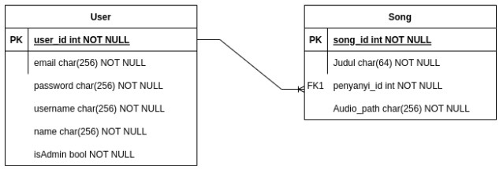

# Web Service REST
## Daftar Isi
- [Deskripsi](#deskripsi)
- [Skema Basis Data](#skema-basis-data)
- [Cara menjalankan server](#cara-menjalankan-server)
- [Endpoint](#endpoint)
- [Pembagian tugas](#pembagian-tugas)
- [Author](#author)

## Deskripsi
REST service yang dapat menangani pengelolaan lagu premium oleh seorang penyanyi. Sistem ini memiliki fitur-fitur sebagai berikut.
- Database
- Autentikasi Pengguna (menggunakan JWT)
- Endpoint untuk lagu premium
- Endpoint untuk list penyanyi
- Endpoint List Lagu dari Penyanyi

## Cara Menjalankan Server
1. Jalankan `npm install` untuk menginstall semua dependency
2. Jalankan `npm run dev` untuk menjalankan aplikasi
3. Jika ingin membuka prisma studio, jalankan `npx prisma studio`

## Skema Basis Data
Skema Database dari sistem ini adalah sebagai berikut.

## Endpoint
| HTTP Verbs | Endpoints | Action |
| --- | --- | --- |
| POST | /register | Untuk register akun baru user |
| POST | /login | Untuk login dengan akun user yang sudah ada |
| GET | /penyanyi | Untuk mendapatkan semua list penyanyi pada database |
| GET | /penyanyi/:user_id/song | Untuk mendapatkan penyanyi dengan user_id tertentu |
| GET | /penyanyi/song | Untuk mendapatkan lagu yang dimiliki seorang penyanyi yang sudah login |
| GET | /subscription | Untuk mendapatkan semua request subscription |
| POST | /subscription/approve | Untuk approve atau menyetujui sebuah subcription request |
| POST | /subscription/reject | Untuk reject atau menolak sebuah subcription request |
| POST | /callback/createSubs | Callback untuk menambahkan subscription user pada penyanyi |
| PUT | /callback/approveSubs | Callback ntuk menyetujui sebuah subscription |
| PUT | /callback/rejectSubs | Callback ntuk menolak sebuah subscription |

## Pembagian Tugas
- Autentikasi Pengguna: 13520096
- Endpoint lagu premium: 13520129
- Endpoint list penyanyi: 13520049
- Endpoint list lagu dari penyanyi: 13520049

## Author
- 13520049 - Aditya Prawira Nugroho
- 13520096 - Monica Adelia
- 13520129 - Nathanael Santoso
